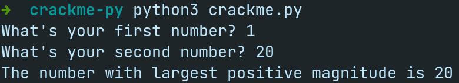
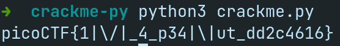

# Writeup for the challenge  **_`crackme-py`_**  from picoGym

- ## Challenge Information:

| -         | -                 |
| --------- | ----------------- |
| Name:     | **`crackme-py`** |
| Category: | **`reverse`**     |
| Points:   | **`30`**          |
| Author:   | **`SYREAL`**      |

-----

- ## Découverte du challenge
  
  On commence par lancer le programme:

  
  
  2 nombres nous sont demandés et le programme nous renvoie le plus élevé des deux, rien de plus à noter.

-----

- ## Analyse du code source
  Deux variables sont définies au début du fichier:
  ```python
  bezos_cc_secret = "A:4@r%uL`M-^M0c0AbcM-MFE055a4ce`eN"

  # Reference alphabet
  alphabet = "!\"#$%&'()*+,-./0123456789:;<=>?@ABCDEFGHIJKLMNOPQRSTUVWXYZ"+ \
            "[\\]^_`abcdefghijklmnopqrstuvwxyz{|}~"
  ```

  `bezos_cc_secret` contient le flag encodé tandis qu' `alphabet` est utilisé pour le décoder.
  On retrouve la fonction qui gère le programme

  ```Python
  def choose_greatest():
    user_value_1 = input("What's your first number? ")
    user_value_2 = input("What's your second number? ")
    greatest_value = user_value_1 # need a value to return if 1 & 2 are equal

    if user_value_1 > user_value_2:
        greatest_value = user_value_1
    elif user_value_1 < user_value_2:
        greatest_value = user_value_2

    print( "The number with largest positive magnitude is " + str(greatest_value) )

  choose_greatest()
  ```

  Comme lors du lancement, rien de spécial n'est à noter.
  Cependant, une autre fonction est définie sans être appelée:
  ```python
  def decode_secret(secret):
    """ROT47 decode

    NOTE: encode and decode are the same operation in the ROT cipher family.
    """

    # Encryption key
    rotate_const = 47

    # Storage for decoded secret
    decoded = ""

    # decode loop
    for c in secret:
        index = alphabet.find(c)
        original_index = (index + rotate_const) % len(alphabet)
        decoded = decoded + alphabet[original_index]

    print(decoded)

  ```

  Cette fonction effectue un simple ROT47 sur la variable passée en paramètre.

-----

- ## Résolution

  Comme le nom de la fonction le laisse suggérer, il faut appeler la fonction `decode_secret()` avec la variable `bezos_cc_secret`

  Dans le programme, on remplace donc
  ```python
  choose_greatest()
  ```
  par
  ```python
  decode_secret(bezos_cc_secret)
  ```

  On relance le programme et on obtient:

  

-----

Flag: **`picoCTF{1|\/|_4_p34|\|ut_dd2c4616}`**