# Writeup for the challenge **_`flagle`_** from DiceCTF 2022
----
- ## Challenge Information:

| - | - |
| ----------- | ----------- |
| Name: | **`flagle`** |
| Category: | **`reverse`** |
| Points: | **`120`**|
| Author: | **`infuzion`**|

## Description:
How hard could it be? Just guess the flag.
  

---

- ## Solution
  En arrivant sur la page du challenge on découvre une grille de taille 6 x 6 composée de formulaire prenant 5 caractères en input
  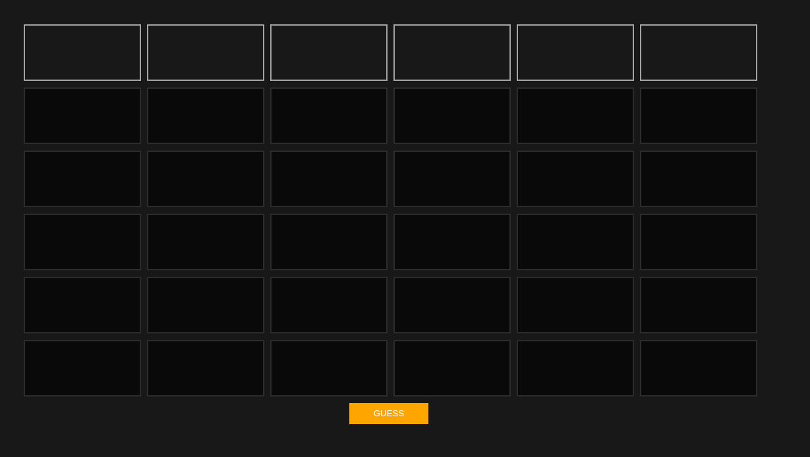
  
  En regardant dans les sources de la page, on trouve plusieurs fichiers Javascript
  
  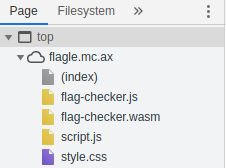
  
  Il semblerait que ce challenge utilise du WASM (Web assembly)
En regardant le code Javascript écrit directement dans la page web on voit qu'un listerner est placé sur le bouton `GUESS`

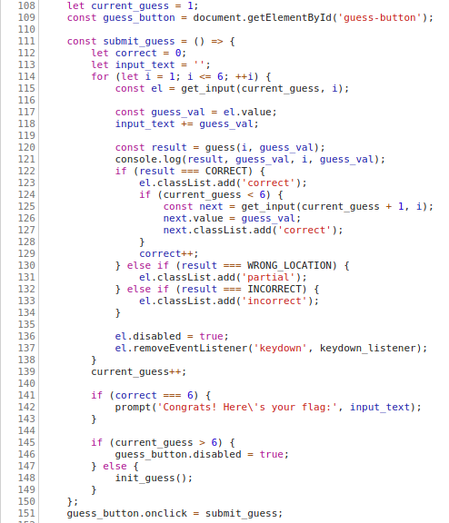

Cette fonction récupère successivement les valeurs de chaque case d'une ligne et les vérifies grâce à la fonction `guess()`

---

### 1ère case: `dice{`
La valeur de cette 1ère case est logique, elle correspond au format des flag pour ce CTF: `dice\{[!-z|~]+\}`
Nous pouvons toutefois le vérifier en regardant la fonction `validate_1`

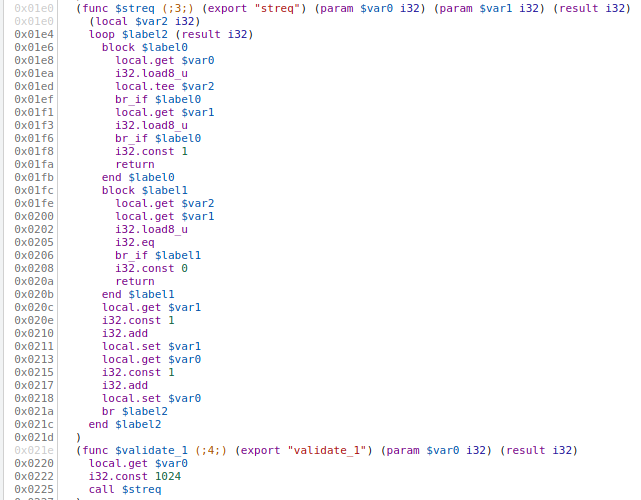

La fonction fait un appel à `streq` qui compare 2 strings placé en mémoire, l'une des 2 correspond à notre 1ère case tandis que la seconde se situe à l'emplacement mémoire 1024

En regardant ledit emplacement on retrouve bien les codes ASCII de `dice{`: `100:d, 105:i, 99:c, 101:e, 123:{`

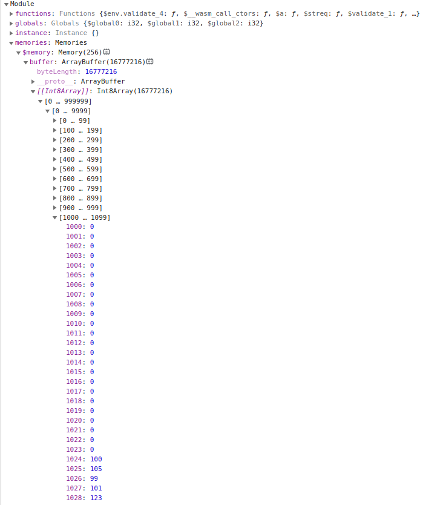

---

### 2ème case: `F!3lD`

Passons à la fonction `validate_2`

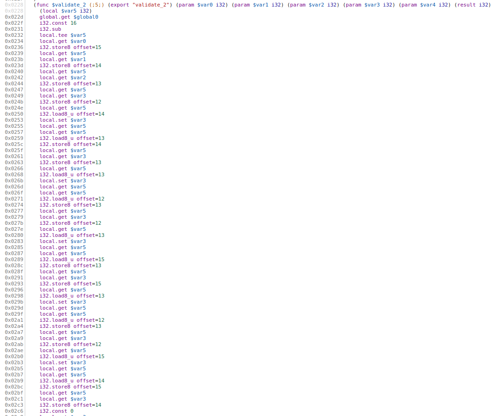
La 1ère partie de cette fonction se contente de stocker nos différents caractères à des emplacements mémoire différents

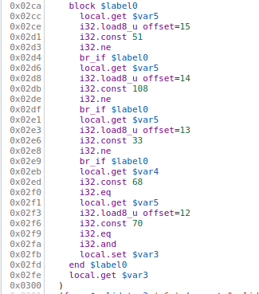

La 2ème partie est relativement simple, le programme récupère les caractères précédement inscrit en mémoire et les compares avec des nombres réprésentant des valeur ASCII
Pour ceux  qui auraient la paresse de faire `man ascii` et retrouver les valeurs une par une, je vous présente une libraire python nommée `z3` [(github)](https://github.com/Z3Prover/z3)
Cette librairie nous permet de retrouver des incconus en ajoutant des conditons à un object nommé `Solver()`, elle nous sera utile pour les prochaines cases

Pour ce 2ème segment du flag, il nous suffit de comparer les caractères aux valeurs ASCII

```python
from z3 import *
 
length = 5
solver = Solver()

s = [BitVec("d%d" % i, 32) for i in range(length)]

for i in range(length):
    solver.add(s[i] >= 32, s[i] <= 127)

solver.add(s[2] == 51)
solver.add(s[3] == 108)
solver.add(s[1] == 33)
solver.add(s[4] == 68)
solver.add(s[0] == 70)
 
while True:
    if solver.check() == z3.sat:
        model = solver.model()
        solution = ''.join([chr(int(str(model[s[i]]))) for i in range(0, length)])
        print(solution)
        break
```

Après avoir lancé le programme, nous retrouvons `F!3lD`

---
### 3ème case: `d0Nu7`

Continuons avec la fonction `validate_3`

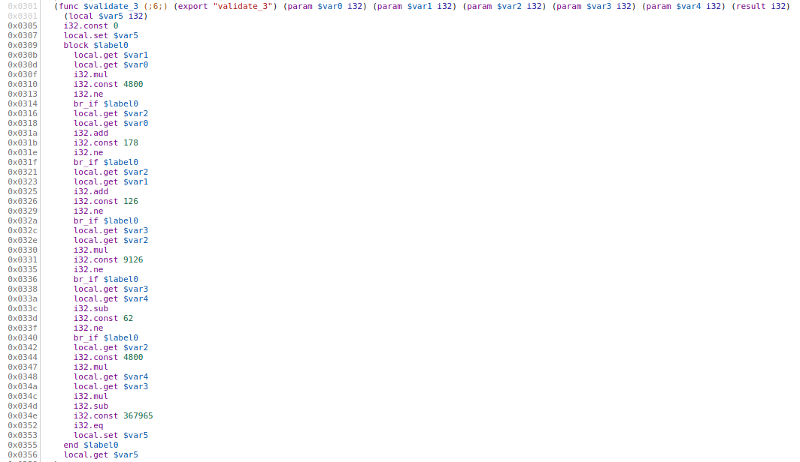

Ici, le programme récupère les caractères et effectue des opération entre eux puis vérifie le résultat obtenu
Un simple programme avec z3 nous permet d'obtenir la valeur de chacun des caractères
```python
solver.add(s[0] * s[1] == 4800)
solver.add(s[2] + s[0] == 178)
solver.add((s[2] + s[1]) == 12)
soler.add((s[3] * s[2]) == 9126)
solver.add((s[3] - s[4]) == 62)
```

La sortie nous donne: `d0Nu7` 


---
### 4ème case: `cwrap`

La 4ème case est un peu différente des autres, la fonction n'est cette fois pas en WASM

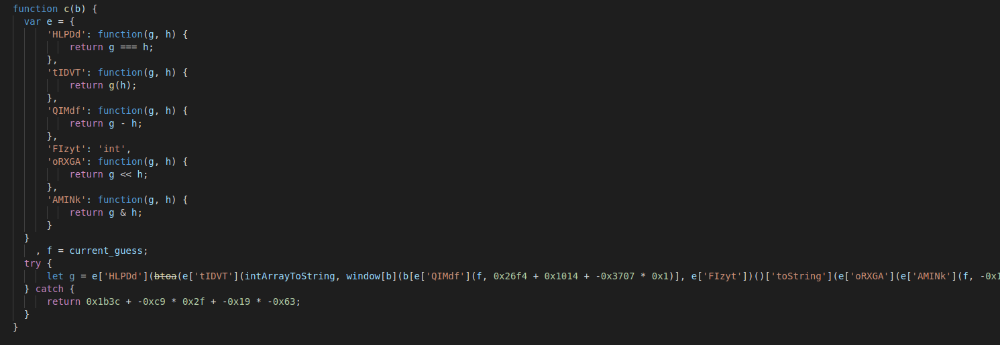

En faisant un peu de ménage dans le code on se retrouve avec
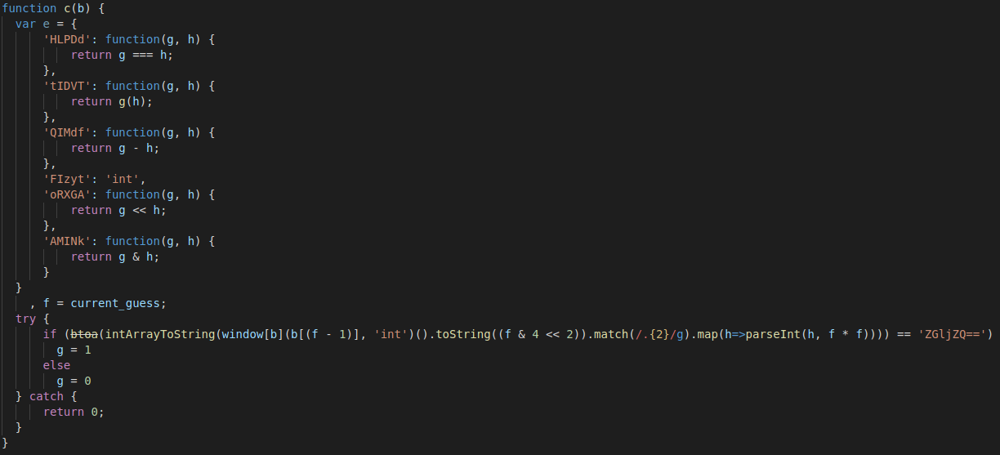

Dans cette fonction la partie qui nous intéresse le plus est


Notre input est utilisé pour appeller une fonction de l'object `window` avec pour paramètre un caractère de notre input et `'int'`, cette fonction doit nous renvoyer une fonction qui sera à son tour exécutée

Pour retrouver cela nous allons utiliser la console web et afficher toute les fonctions de window avec un identifiant de 5 caractères


La fonction `cwrap()` semble correspondre, elle peut prendre `'int'` pour son paramètre `returnType` et nous renvoie bien une fonction

Néanmoins cette valeur ne pourra être vérifié que dans des conditions particulière, la variable `f` correspond à la ligne actuelle de  notre grille et la seule fonction avec pour identifiant un caractère unique est `a()`, cela à pu être trouvé avec la console  web


`a` étant à l'index 3 de la string `'cwrap'`,la condition n'est vérifiable qu'à la ligne 4


---
### 5ème case: `m@x!M`

On repart sur une fonction en WASM
Après un début de code similaire à la fonction `validate_2`, le programme va ajouter des valeurs à nos caractères

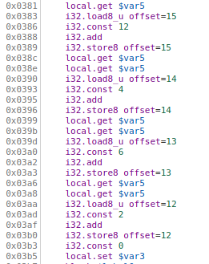

Une vérification est ensuite appliquée

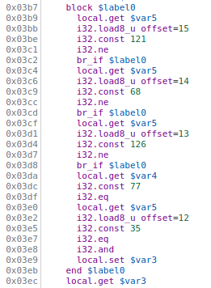

Encore une fois, z3 nous permet de retrouver chaque valeur

```python
solver.add(s[0] + 12 == 121)
solver.add(s[1] + 4 == 68)
solver.add(s[2] + 6 == 126)
solver.add(s[4] == 77)
solver.add(s[3] + 2 == 35)
```
Output: `m@x!M`

---
### 6ème case: `T$r3}`

On termine avec la fonction `validate_6`

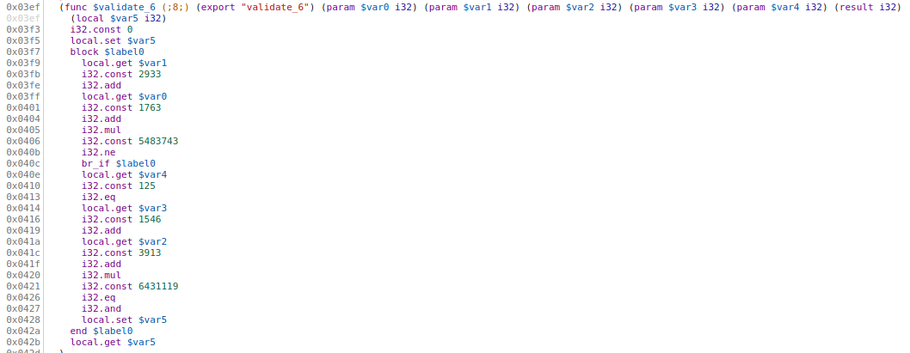

Un petit coup de `z3` pour terminer

```python
solver.add((s[1] + 2933) * (s[0] + 1763) == 5483743)
solver.add(s[4]  == 125)
solver.add((s[3] + 1546) * (s[2] + 3913) == 6431119)
```
Output: `T$r3}`

Le site nous informe que le flag est bel et bien trouvé

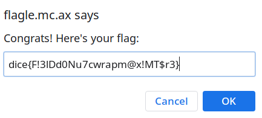

---
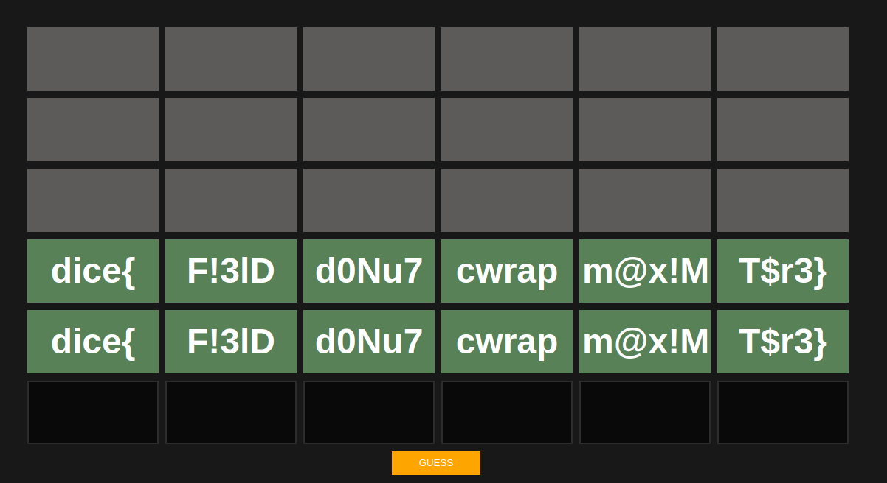

Flag : **`dice{F!3ldd0Nu7cwrapm@x!MT$r3}`**

