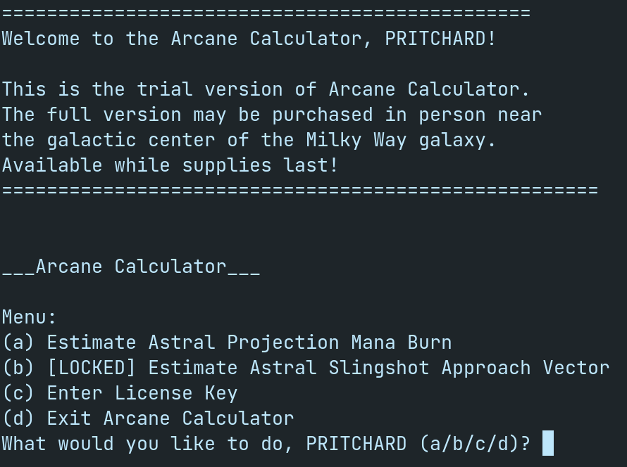
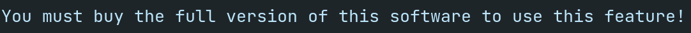
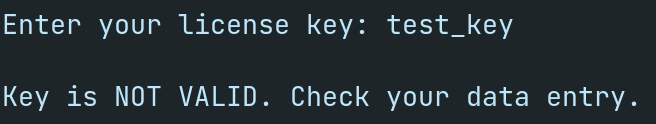
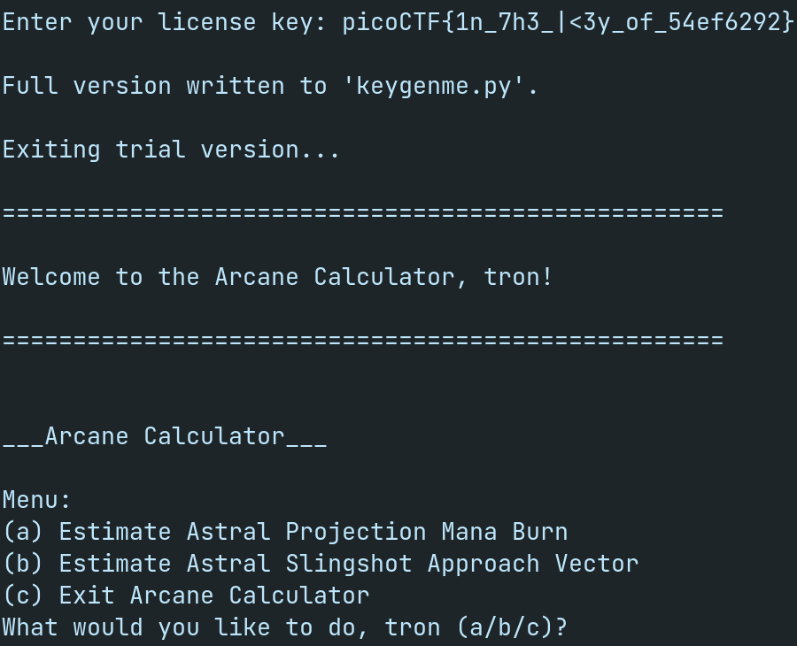

# Writeup for the challenge  **_`keygenme-py`_**  from picoGym

- ## Challenge Information:

| -         | -                 |
| --------- | ----------------- |
| Name:     | **`keygenme-py`** |
| Category: | **`reverse`**     |
| Points:   | **`30`**          |
| Author:   | **`SYREAL`**      |

-----

- ## Découverte du challenge
  Commençons par lancer le fichier keygenme-trial.py qui nous est fourni.

  
  Plusieurs options s'offrent à nous, mais les 2 plus intéréssantes semblent être la b avec son label `[LOCKED]` et la c qui demande un input.
  
  L'options b nous affiche
  
  Pas possible de l'utiliser pour l'instant.

  L'option c quant à elle nous demande bien d'entrer un clé, c'est surement en entrant une clé valide que l'on pourra accéder à l'option b.
  

-----

- ## Analyse du code source
  Plusieurs variables globales sont définies au début du fichier:

  -  Le nom de l'utilisateur et son équivalent en `bytes`:
     ```python
     username_trial = "PRITCHARD"
     bUsername_trial = b"PRITCHARD"
     ```

  -  Les deux parties statiques du flag:
     ```python
     key_part_static1_trial = "picoCTF{1n_7h3_|<3y_of_"
     key_part_static2_trial = "}"
     ```
  -  La partie dynamique du flag, c'est celle que nous devons modifier pour obtenir un clé valide:
     ```python
     key_part_dynamic1_trial = "xxxxxxxx"
     ```
  -  La concaténation de toute les variables composant le flag, sa valeur par défaut est donc de **`picoCTF{1n_7h3_|<3y_of_xxxxxxxx}`**:
     ```python
     key_full_template_trial = key_part_static1_trial + key_part_dynamic1_trial + key_part_static2_trial
     ```

  On retrouve dans le code les différentes fonctions associées aux choix a/b/c/d:

  ```python
  if choice == "a":
    estimate_burn()
  elif choice == "b":
    locked_estimate_vector()
  elif choice == "c":
    enter_license()
  elif choice == "d":
    global arcane_loop_trial
    arcane_loop_trial = False
    print("Bye!")
  ```
     

  C'est `enter_license()` qui nous intéresse le plus:
  ```python
  def enter_license():
    user_key = input("\nEnter your license key: ")
    user_key = user_key.strip()

    global bUsername_trial
    
    if check_key(user_key, bUsername_trial):
        decrypt_full_version(user_key)
    else:
        print("\nKey is NOT VALID. Check your data entry.\n\n")
  ```

  Le programme récupère notre input et le transmet à la fonction  `check_key()`, cette dernière vérifie en 2 étapes la clé entrée et renvoie `True` ou `False`.

  La 1ère partie est relativement simple:
  ```python
  global key_full_template_trial

  if len(key) != len(key_full_template_trial):
      return False
  else:
    i = 0
    for c in key_part_static1_trial:
      if key[i] != c:
        return False
      if key[i] != hashlib.sha256(username_trial).hexdigest()[4]:
        i += 1
  ```

  Une vérification de la longueur de la clé est effectuée puis une boucle sur la 1ère partie vérifie que notre clé commence par **`picoCTF{1n_7h3_|<3y_of_`**.

  La deuxième partie vérifie les 8 caractères dynamiques du flag:
  ```python
  if key[i] != hashlib.sha256(username_trial).hexdigest()[4]:
      return False
  else:
      i += 1

  if key[i] != hashlib.sha256(username_trial).hexdigest()[5]:
      return False
  else:
      i += 1

  if key[i] != hashlib.sha256(username_trial).hexdigest()[3]:
      return False
  else:
      i += 1

  if key[i] != hashlib.sha256(username_trial).hexdigest()[6]:
      return False
  else:
      i += 1

  if key[i] != hashlib.sha256(username_trial).hexdigest()[2]:
      return False
  else:
      i += 1

  if key[i] != hashlib.sha256(username_trial).hexdigest()[7]:
      return False
  else:
      i += 1

  if key[i] != hashlib.sha256(username_trial).hexdigest()[1]:
      return False
  else:
      i += 1

  if key[i] != hashlib.sha256(username_trial).hexdigest()[8]:
      return False
  
  return True
  ```
  Toutes ces conditions vérifient que la partie dynamique de la clé est égale à certains caractères du sha256 du nom de l'utilisateur.

-----

- ## Résolution
  
  La seule inconnue dans le flag est la partie dynamique, pour cela un petit bout de code suffit:
  ```python
  password = hashlib.sha256(username_trial).hexdigest()
  print(password[4] + password[5] + password[3] + password[6] + password[2] + password[7] + password[1] + password[8])
  ```
  Une fois exécuté nous obtenons **`54ef6292`**

  Il ne reste plus qu'à rentrer le flag complet:

  

  La mention `[LOCKED]` a disparu, le flag est obtenu: Challenge réussi !

  -----

  Flag: **`picoCTF{1n_7h3_|<3y_of_54ef6292}`**
